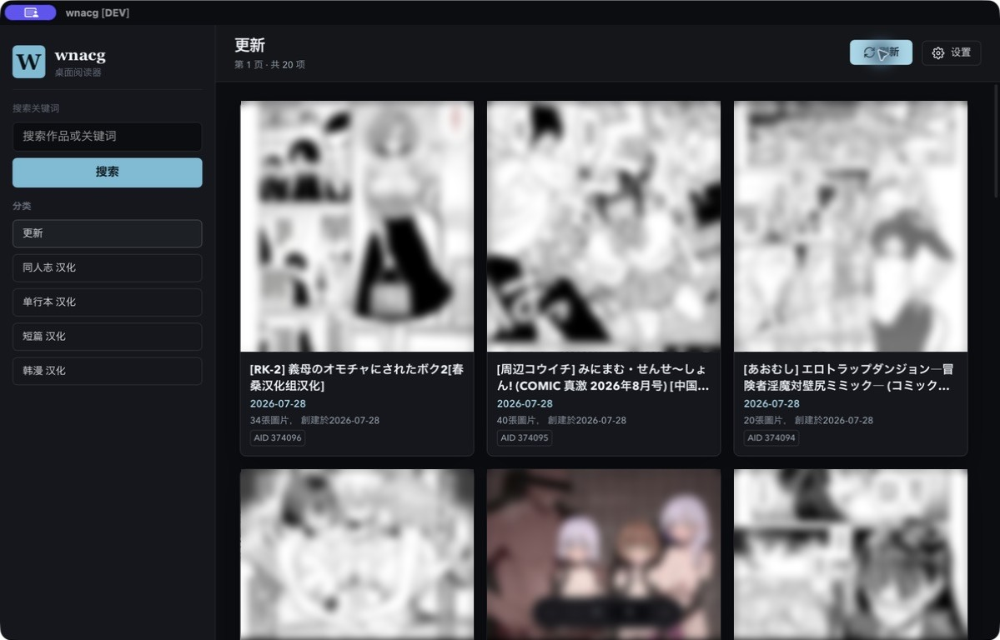
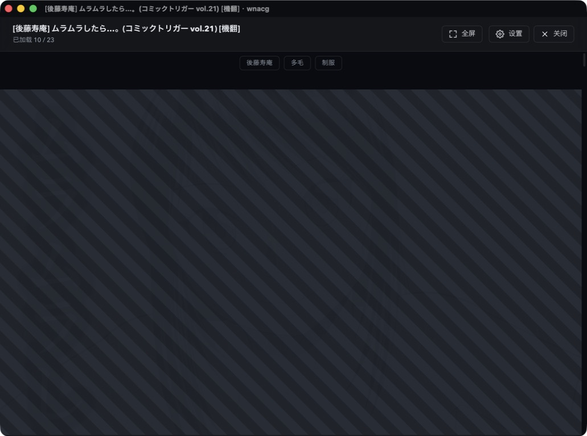

<table>
  <tr>
    <td width="38%" align="center">
      
    </td>
    <td width="62%">
      <h1>wnacg</h1>
      <p><strong>把浏览和连续阅读，安静地放进桌面。</strong></p>
      <p>一个使用 Tauri 2、TypeScript 与 Rust 构建的桌面阅读器实验。</p>
      <p>
        <a href="#从源码构建"><strong>从源码构建 →</strong></a>
        &nbsp;·&nbsp; <a href="#使用边界">使用边界</a>
      </p>
    </td>
  </tr>
</table>

> **仅限成年人。** 本项目仅提供源码，用于编程学习与技术研究；不提供安装包，也不托管任何第三方内容。页面中的封面与阅读图片均已隐藏。

## 先找到想看的

分类、关键词搜索、标签跳转和连续加载都在同一个窗口里。阅读进度会保存在本机，下次打开时可以从上次的位置继续。



## 打开后，直接往下读

阅读页尽量把界面让给内容。宽度、图片间距、背景和预加载策略都可以调整；需要细看时，点击图片即可放大或进入全屏。



<table>
  <tr>
    <td width="33%">
      <strong>连续阅读</strong><br><br>
      瀑布流加载、进度提示、失败重试和图片缩放。
    </td>
    <td width="33%">
      <strong>独立窗口</strong><br><br>
      把作品单独打开，列表与阅读互不打扰。
    </td>
    <td width="33%">
      <strong>本地记录</strong><br><br>
      阅读偏好和最近进度保存在本机，无需注册账号。
    </td>
  </tr>
</table>

## 从源码构建

需要 [Node.js](https://nodejs.org/)、[Rust](https://www.rust-lang.org/tools/install)，以及 [Tauri 2 的系统依赖](https://v2.tauri.app/start/prerequisites/)。

```bash
git clone https://github.com/yuxino/wnacg.git
cd wnacg
npm install
npm run tauri dev
```

构建当前平台的应用：

```bash
npm run tauri build
```

> 仓库不发布预编译安装包。构建与运行前，请确认自己已年满 18 周岁，并理解下方的使用边界。

<details>
<summary><strong>使用提示</strong></summary>

<br>

- 在列表底部继续滚动会自动加载更多内容
- 点击标签可以查找同类内容
- 阅读时按空格键可以继续向下翻页
- 页面暂时无法载入时，可以点击右上角的刷新按钮
- 关闭窗口不会退出应用；需要完全退出时请使用菜单栏图标

</details>

## 使用边界

<details>
<summary><strong>使用前请阅读：仅限 18 周岁以上使用者</strong></summary>

<br>

- 本项目仅供学习与技术研究，不鼓励、不协助传播违法或侵权内容
- 未满 18 周岁者不得下载、构建、运行或以其他方式使用本项目
- 使用者应自行确认其行为符合所在地法律、内容来源条款及相关平台规则
- 不得使用本项目访问、保存或传播涉及未成年人的性内容、非自愿私密内容或其他违法内容
- 项目不提供、不上传、不托管第三方作品；内容由使用者所访问的第三方来源提供
- 第三方内容可能受到著作权及其他权利保护；请勿复制、再分发或用于商业用途
- 项目维护者无法控制第三方来源的可用性、安全性与内容，也不对使用者的具体行为背书

免责声明不能替代法律。若你无法判断某项使用是否合法，请停止使用并咨询所在地的专业人士。

</details>

## 参与开发

欢迎提交 [Issue](https://github.com/yuxino/wnacg/issues) 和 Pull Request。请勿在 Issue、PR 或截图中上传露骨内容。
