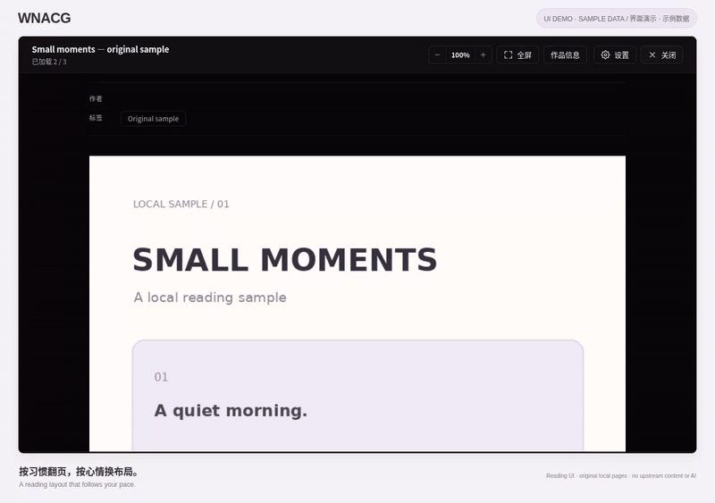

<div align="center">
  <br>
  
  <h1>wnacg</h1>
  <p><strong>简体中文</strong> · <a href="README.en.md">English</a></p>
  <p>一个面向 WNACG 的桌面漫画阅读器，提供专注阅读、本地 OCR 与可选翻译；应用界面目前仅提供简体中文。</p>
</div>

> 18+。仓库和安装包不包含第三方漫画、图片内容或 OCR 模型权重。

<!-- project-demo-v1 -->
## 演示

[](docs/demos/demo.mp4)

[完整视频（MP4）](docs/demos/demo.mp4) · [演示说明](docs/demos/README.md)

原创示例页的连续、单页和双页阅读。 真实前端录制，使用示例数据。不访问上游站点，不包含第三方漫画、OCR 或翻译结果。
<!-- /project-demo-v1 -->

## 下载与平台

请从 [Releases](https://github.com/yuxino/wnacg/releases) 下载：

- **Windows x64**：支持 64 位 Windows 10 1709+ 和 Windows 11。当前安装包标记为 preview；安装、启动、浏览、设置和基础阅读已在 Windows 11 验证。安装包未签名，可能触发 SmartScreen 或企业策略提示；缺少 Microsoft Edge WebView2 Runtime 时会联网安装。
- **macOS**：支持 macOS 11+ 的 Apple 芯片 Mac。安装包为 ad-hoc 签名且未经公证。

暂不提供 Intel Mac 或 Linux 安装包。Windows 已内置 x64 日文 OCR 辅助程序，但首次模型下载、真实识别和 DeepSeek 翻译尚未完成端到端 Windows 验收。

### 应用内更新

`v0.1.11` 是签名更新能力的引导版本。旧版本还没有更新器，所以这次仍需从 Releases 手动安装一次。安装包和更新包都带有独立签名，应用不会内置 GitHub Token，也不会静默下载或安装。

当前 Release 按要求保持私有。由于桌面应用不能安全内置仓库凭证，应用内检查无法匿名读取私有 Release；请登录 GitHub 后从 Releases 手动获取后续版本。检查失败时，设置页会提供发布页入口。

## 功能

- 按分类浏览和关键词搜索，并通过作品信息继续浏览作者、标签和分类
- 连续、单页和双页阅读，支持键盘翻页、全屏、缩放和独立阅读窗口
- 本地 OCR：macOS 可使用 Apple Vision；日文识别使用 `comic-text-detector` 与 `manga-ocr`
- 可选 DeepSeek 翻译，可翻译日文对话与标题并在图片上排版
- 显示识别、翻译和可重试错误状态，并在站点限流时自动降速
- 签名更新基础、真实下载进度状态，以及私有更新检查失败后的明确恢复入口

## 本地运行

项目基于 Tauri 2。开发需要 [Node.js](https://nodejs.org/)、[Rust](https://www.rust-lang.org/tools/install) 和 [Tauri 2 系统依赖](https://v2.tauri.app/start/prerequisites/)。

```bash
git clone https://github.com/yuxino/wnacg.git
cd wnacg
npm ci
npm run tauri dev
```

```bash
npm run tauri build
```

## 本地数据与隐私

OCR 在本机运行。首次启用日文 OCR 会从 Hugging Face 下载约 224 MiB 的固定版本模型并缓存；Windows 安装包已内置辅助程序，无需另外安装 Rust。macOS 使用 Apple Vision 时需要 Xcode Command Line Tools。

DeepSeek 翻译是可选云端功能，只发送待翻译的文字和标题，不发送图片；原文与译文缓存在本机。API Key 在 macOS 保存到钥匙串，在 Windows 保存到 Windows 凭据管理器。

仓库暂未附项目级开源许可证。OCR 模型及训练数据也尚未完成正式分发许可审查；请勿把自动下载视为再分发授权。

## 说明

项目会连接 WNACG 及其图片域名，并依赖上游页面结构；站点改版可能导致功能失效。请遵守所在地法律与站点规则，Issue、提交和截图中不要包含露骨内容。
