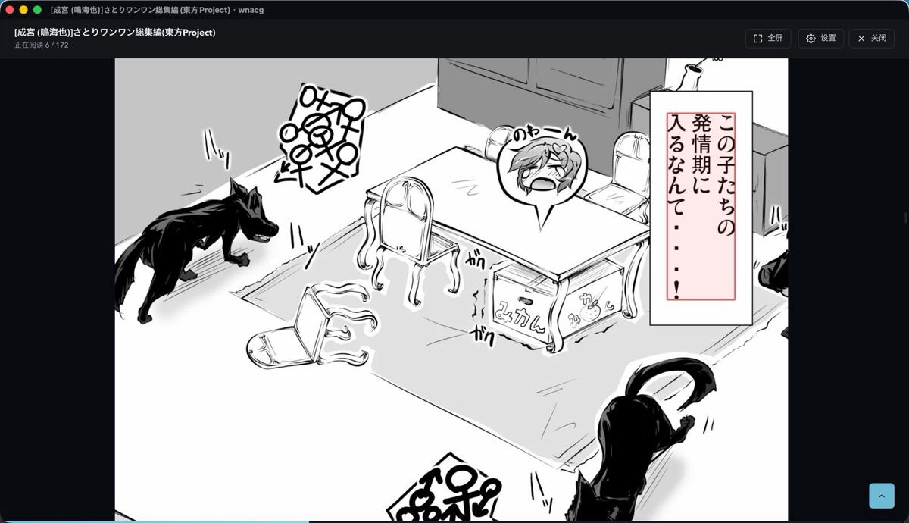
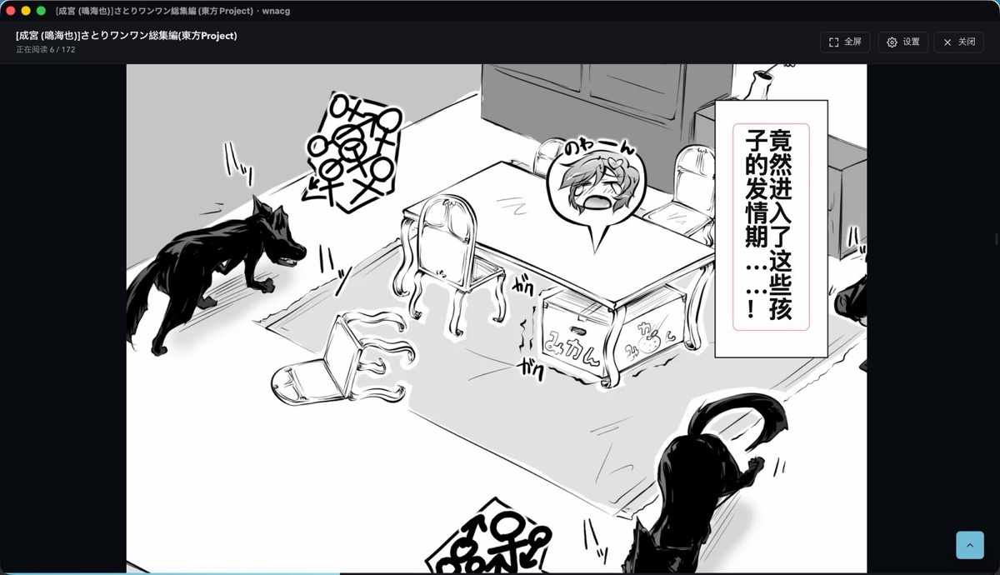

<div align="center">
  <br>
  
  <h1>wnacg</h1>
  <p><a href="README.md">English</a> · <strong>简体中文</strong></p>
</div>

<p align="center">给 wnacg 套了个桌面壳，顺手塞了个翻译组。</p>

<p align="center">
  <a href="#截图"><strong>截图</strong></a>
  · <a href="#有什么">有什么</a>
  · <a href="#本地跑">本地跑</a>
  · <a href="#先说好">先说好</a>
</p>

<br>

浏览器标签开烦了，就写了这个。分类、关键词和标签都能搜，点进去直接往下看；阅读位置和显示设置存在本机，关掉再打开还是上次那页。

> 18+。仓库只有源码，没有安装包。

## 截图

首页。左边选分类、关键词或者搜索，右边往下翻，封面默认高斯模糊。


点开就是连续阅读，进度和设置都记在本机，也能扔到单独的窗口里。


生肉最头疼的是竖排日文。本地 OCR 先把字框出来、认出来，再调 DeepSeek 翻译，最后按原气泡嵌回原位。





## 有什么

- 分类 / 关键词 / 标签搜索，封面高斯模糊
- 连续阅读、全屏和缩放，阅读位置和显示设置本机保存，支持多窗口打开作品
- **本地 OCR 文字框**：横排中文走 Apple Vision；竖排日文（生肉最头疼的縦書き）走漫画专用模型（comic-text-detector 找框 + manga-ocr 认字）。模型约 230MB，首次使用时自动下载到本机，识别全程离线
- **翻译字幕**：识别出日文后调 DeepSeek 翻译，原文字幕盖掉，译文按气泡排版嵌回原位（横排自动换行、竖排从右往左、圆体字、标点转正）。当前页前 1 页、后 3 页提前翻译，翻页基本不用等；悬停译文可看原文，失败可点击重试
- **生肉标题翻译**：列表和详情标题一键转中文，作者 / 社团 / DL 版等方括号内容保留原文，翻译结果本地缓存

壳是 Tauri 2，界面用 TypeScript，抓取和图片代理在 Rust 里。

## 本地跑

需要 [Node.js](https://nodejs.org/)、[Rust](https://www.rust-lang.org/tools/install) 和 [Tauri 2 的系统依赖](https://v2.tauri.app/start/prerequisites/)。macOS 上本地 OCR 还需要 Xcode 命令行工具（swiftc）；漫画引擎首次使用时会用 cargo 编译一次。

DeepSeek 密钥：翻译功能读取 `~/Library/Application Support/wnacg/config.json` 里的 `deepseekApiKey`，也可以设置环境变量 `DEEPSEEK_API_KEY` 覆盖。

```bash
git clone https://github.com/yuxino/wnacg.git
cd wnacg
npm install
npm run tauri dev
```

打包：

```bash
npm run tauri build
```

## 先说好

仓库里没有第三方内容，也不会替你上传或者保存。用的时候自己看所在地法律和站点规则；侵权内容别存、别传，涉及未成年人或非自愿私密内容的东西更不要碰。

上游改版以后项目可能会坏。有问题可以开 Issue，想改直接提 PR。Issue、提交和截图里不要放露骨内容。
